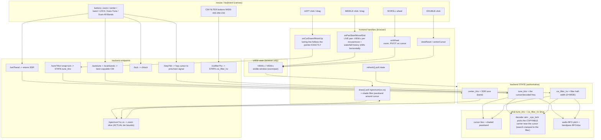
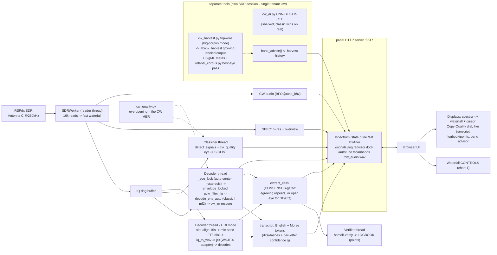
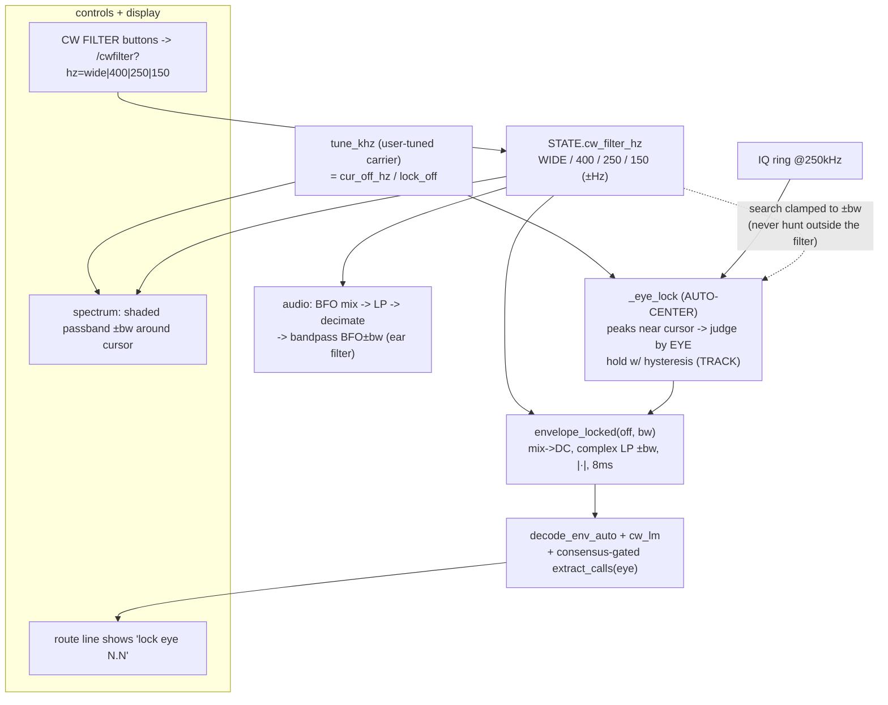

# hamTuna panel — controls & architecture (don't break the flow)

Reference for the panel's waterfall/tuning controls and how they wire into the
greater hamTuna system. Edit the panel's interaction code against this so a UI
change doesn't silently break tuning/decode/audio.

> **Guard:** `python tools/docs_guard.py` lints these charts (unbalanced
> quotes/brackets, encoding rot, arrow typos) **and** fails on endpoint drift —
> any `u.path` the panel serves that this doc doesn't mention. Run it after
> touching panel controls or these charts; it caught `/step` going uncharted.
> Chart law: no volatile numbers/dates in chart labels (they rot silently).

## 1. Waterfall controls — interaction flow

## The control contract (how the user wants it — don't regress)

| input | action |
|-------|--------|
| **left click / drag** | grab & move the tuning line EXACTLY under the pointer (the mouse is the target). Only this + Auto-Tune/Scan/signal-click ever move `tune_khz`. |
| **middle click + drag** | slide the waterfall left/right through the band **live** (real-time). |
| **scroll wheel** | zoom in/out, **pivoting on the tuning cursor** (cursor stays put, band expands/contracts around it). |
| **double-click** | reset to full band. |
| **⊙ button** | recenter view on the cursor (find it). **⤢** full band. **+/−** zoom. |
| **AUTO-TUNE** | best copyable CW on the CURRENT band. |
| **SCAN ALL BANDS** | live hop every CW band, tune to the best (guarded, gentle dwell). |

**Invariants — do not break:**
- The cursor moves ONLY on click/drag/auto — never while zooming or panning.
- **Never retune the SDR rapidly** — the RSPdx firmware wedges on fast successive
  `setFrequency`. Band-hop scans use a >=2s dwell + a SCANNING guard; the reader
  self-heals a stalled SDR (reopens after ~8s of no data).
- Every worker thread body is wrapped so a bug can't kill the thread and freeze the
  server (the decoder-new-callsign crash taught us this).
- **VIEW (browser) is separate from STATE (backend).** Zoom/pan change only VIEW
  (the visible window); they never retune the SDR. Only band change moves `center_khz`.
- **`tune_khz` is the one cursor truth** — it drives the cursor line, the decoder
  offset (`cur_off_hz`, then `find_offset ±700 Hz`), and the audio BFO. Left click/drag
  is the only mouse action that sets it (plus Auto-Tune / signal-list click).
- **`/spectrum?vc&vs` returns the ACTUAL bin-aligned center/span** of the slice, not
  the requested values — otherwise signals drift off the cursor on zoom.
- **Zoom pivots on `tune_khz`** so the tuned signal stays put while zooming.
- **Waterfall clears (`wfDirty`) on any zoom/pan/reset** so it repaints at the new scale.
- **no-cache headers on every response** so the browser never serves a stale page.

## 2. Where controls fit in the greater hamTuna system

**System laws (from memory / hard-won):**
- Reader / decoder / classifier / server on **separate threads**; the reader only
  writes the gap-free ring, decode happens off-thread (a slow decode on the read
  thread drops samples).
- Decoder is **classic `decode_env_auto` + `cw_lm`** (reads real callsigns 13/13);
  the neural `cw_ai` is opt-in and currently loses to classic on real signals.
- **FT8 mode** (`DECODERS["FT8"]` -> `decode_ft8`) slot-aligns a 15 s window, mixes
  the band's FT8 dial to baseband, and runs the **jt9 (WSJT-X) engine-adapter**
  (`ft8_live.py`) - we wrap the world-class decoder, never reimplement it. Decoded
  callsigns feed the same LOGBOOK. New mode == new decoder function in `DECODERS`
  (validated: 13 decodes/slot on a real 20 m capture, live SDR validation pending).
- `cw_quality` eye-opening is the honest copyability metric (pre-decode), feeding
  both the classifier tags and the Copy-Quality dial.
- Panel and harvester are **single-tenant on the SDR** — run one at a time.

## 3. CW filter + auto-centering lock — BUILT 2026-07-24 (pending live validation)

**Why:** Campaign 2 (lab/science_log.md) proved the decoder CORE is near-optimal;
the remaining gap to a skilled human ear is SIGNAL SELECTION + narrow listening,
not the timing math. `cw.envelope()` detects over the full ±aud/2 (~4 kHz) noise
bandwidth; a CW signal is ~100–150 Hz wide. Band-limiting to ±bw around the tuned
carrier BEFORE the magnitude detector buys ~10·log10((aud/2)/bw) ≈ **14 dB** — the
classic weak-CW "tune-in" win. `cw.envelope2(iq,fs,off,aud,bw_hz)` already exists
and is validated on single-carrier IQ (copy-floor 0.90→2.20). The catch, proven in
EXP-5: a narrow filter is UNFORGIVING of centering — it must sit on the ONE signal
the user tuned, or it deletes it (KI4XH vanished when centered on a neighbour).
So the filter is a PANEL feature keyed to `tune_khz` (the user picked the signal),
NOT an offline default.

**Control contract (AS BUILT):**

| input | action |
|-------|--------|
| **CW FILTER buttons** WIDE / 400 / 250 / 150 | `/cwfilter?hz=` → `STATE.cw_filter_hz` (±Hz half-width; 0=WIDE). Default **400** = the classic single-station filter (pre-feature behaviour). |
| effect | decode runs on `envelope_locked(off, bw)`; audio gets a BFO±bw bandpass after decimation; spectrum shades the passband ±bw around the cursor; carrier search is clamped to ±bw. |
| **auto-center lock** (no button — always on) | `_eye_lock`: FFT peaks near the cursor + the exact click offset → each judged by EYE-opening → best wins; **hysteresis** holds the tracked carrier through key-ups unless a new one is clearly better (≥4/3×); re-acquires when `tune_khz` changes. `lock eye N.N` shown on the route line. |
| **consensus-gated logging** | `extract_calls(text, eye)`: ≥2 agreeing repeats log at any eye (signal redundancy); a single after-DE/CQ call logs only with an OPEN eye (≥3) — kills false-calls-from-noise (EXP-9). |

**As-built status (2026-07-24, Fable 5):** all six checklist items DONE in panel.py
(`CW_FILTER_CHOICES`, `_decode_taps`/`_audio_bp` caches, `_eye_lock`+`TRACK`,
`/cwfilter`, buttons+shading, search clamp). Offline-validated: sloppy +250 Hz click
→ lock lands 6 Hz off the true carrier, ±400 decode reads clean copy; test_cw PASS.
**Remaining: LIVE-SDR validation** (single-tenant — needs the harvester paused):
tune a weak signal, WIDE vs 250/150, confirm the eye opens and copy improves in QRM.

**Invariants:** default `cw_filter_hz=400` reproduces the pre-feature decode path
(same taps); WIDE (0) = no narrow stage. The filter/lock never move `tune_khz`/
`center_khz` — they aim detection around the carrier the user chose. Scan/classifier
paths pin `bw=400` so the user's filter pick can't skew band scanning.
