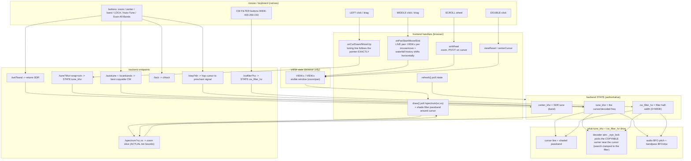
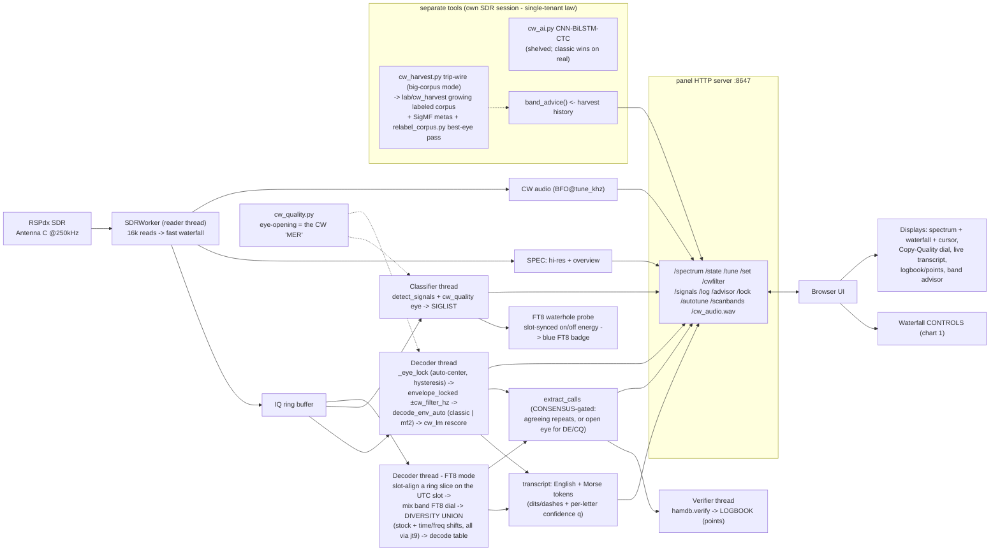
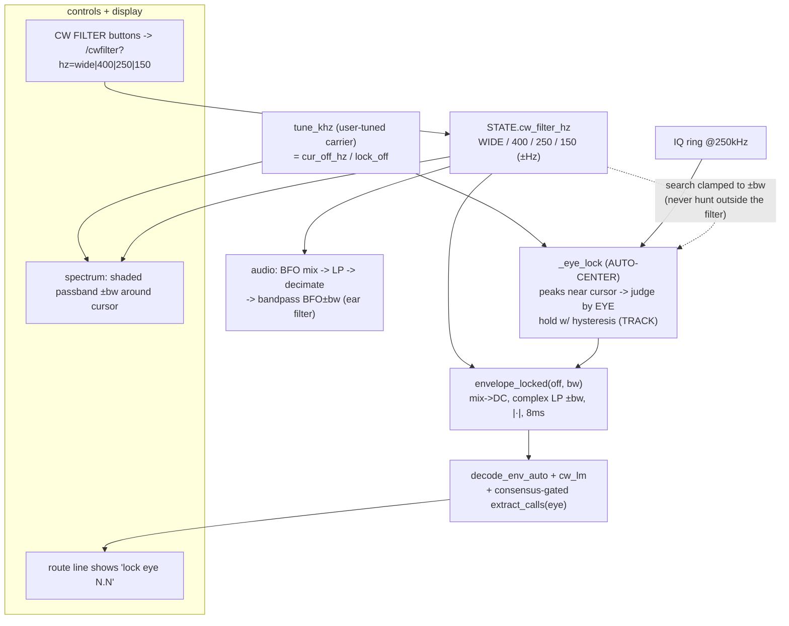

# hamTuna panel — controls & architecture (don't break the flow)

Reference for the panel's waterfall/tuning controls and how they wire into the
greater hamTuna system. Edit the panel's interaction code against this so a UI
change doesn't silently break tuning/decode/audio.

> **Guard:** `python tools/docs_guard.py` lints these charts (unbalanced
> quotes/brackets, encoding rot, arrow typos) **and** fails on endpoint drift —
> any `u.path` the panel serves that this doc doesn't mention. Run it after
> touching panel controls or these charts; it caught `/step` going uncharted.
> Chart law: no volatile numbers/dates in chart labels (they rot silently).

## 1. Waterfall controls — interaction flow

## The control contract (how the user wants it — don't regress)

| input | action |
|-------|--------|
| **left click / drag** | grab & move the tuning line EXACTLY under the pointer (the mouse is the target). Only this + Auto-Tune/Scan/signal-click ever move `tune_khz`. |
| **middle click + drag** | slide the waterfall left/right through the band **live** (real-time). |
| **scroll wheel** | zoom in/out, **pivoting on the tuning cursor** (cursor stays put, band expands/contracts around it). |
| **double-click** | reset to full band. |
| **⊙ button** | recenter view on the cursor (find it). **⤢** full band. **+/−** zoom. |
| **AUTO-TUNE** | best copyable CW on the CURRENT band. |
| **SCAN ALL BANDS** | ASYNC (8/03): `/scanbands` starts a guarded worker and returns at once; the page follows progress via `/state`'s `scan` object (`running/at/results/done/best`). Per band: one settle + ring fill, then ONE `cw_map` whole-band keying-fingerprint look (every bin at once) — no per-carrier probing, no server lock held, a second press gets `busy` instead of freezing the UI. Ends tuned to the strongest fist found. |
| **EARS lane** | `EarsDecoder` thread decodes the SAME audio stream the user hears (tone-find → envelope → classic decoder) every ~25 s into `decode.ears` (`text/wpm/tone_hz/elements`), shown under the transcript (`#earsline`). The referee when the IQ lane shows nothing but a human clearly hears Morse (born from the 8/03 live session). |
| **badge clicks (mode-aware, 8/05)** | ONE waterfall, no live-air tabs. Green `●CW`/gray `?` badge → mode CW + tune (the classic audio+banner+transcript flow); blue `● FT8 ×N` badge (over the waterhole, from the classifier's slot-sync probe, served as `/signals`' additive `ft8` field) → mode FT8 + tune to the dial. The bottom pane TRANSFORMS with the mode: CW = transcript+ears, FT8 = the decode table (`#ft8pane`: call/grid/dB/message, refreshed each 15 s UTC slot). Badges keep the onmousedown + stable-DOM pattern — rebuild only when the signal set changes. |

**Invariants — do not break:**
- The cursor moves ONLY on click/drag/auto — never while zooming or panning.
- **Never retune the SDR rapidly** — the RSPdx firmware wedges on fast successive
  `setFrequency`. Band-hop scans use a >=2s dwell + a SCANNING guard; the reader
  self-heals a stalled SDR (reopens after ~8s of no data).
- Every worker thread body is wrapped so a bug can't kill the thread and freeze the
  server (the decoder-new-callsign crash taught us this).
- **VIEW (browser) is separate from STATE (backend).** Zoom/pan change only VIEW
  (the visible window); they never retune the SDR. Only band change moves `center_khz`.
- **`tune_khz` is the one cursor truth** — it drives the cursor line, the decoder
  offset (`cur_off_hz`, then `find_offset ±700 Hz`), and the audio BFO. Left click/drag
  is the only mouse action that sets it (plus Auto-Tune / signal-list click).
- **`/spectrum?vc&vs` returns the ACTUAL bin-aligned center/span** of the slice, not
  the requested values — otherwise signals drift off the cursor on zoom.
- **Zoom pivots on `tune_khz`** so the tuned signal stays put while zooming.
- **Waterfall clears (`wfDirty`) on any zoom/pan/reset** so it repaints at the new scale.
- **no-cache headers on every response** so the browser never serves a stale page.

## 2. Where controls fit in the greater hamTuna system

**System laws (from memory / hard-won):**
- Reader / decoder / classifier / server on **separate threads**; the reader only
  writes the gap-free ring, decode happens off-thread (a slow decode on the read
  thread drops samples).
- Decoder is **classic `decode_env_auto` + `cw_lm`** (reads real callsigns 13/13);
  the neural `cw_ai` is opt-in and currently loses to classic on real signals.
- **FT8 mode** (`DECODERS["FT8"]` -> `decode_ft8`) carves the last COMPLETED
  :00/:15/:30/:45 UTC slot out of the SAME 250 kHz ring the waterfall runs on
  (never a second SDR session — the waterhole rides inside the window on every
  `BANDS` entry), mixes the band's FT8 dial to baseband, and runs the **jt9
  (WSJT-X) engine-adapter** (`ft8_live.py` invocation) — we wrap the world-class
  decoder, never reimplement it. The shipped path is the **DIVERSITY UNION**
  proven overnight 8/04-05 (`lab/FT8_NIGHT_REPORT.md`): the same slot decoded
  stock + time-shifted (±0.25/±0.5 s) + freq-shifted (±1.5 Hz), unioned by unique
  CRC-valid message — union beat stock in 101/101 differing cycles (+9.5%
  decodes); the wide-window variant LOST and is not shipped. One full decode per
  slot (cached in between so transcript/logbook never double-count). Decoded
  callsigns feed the same LOGBOOK: FT8's CRC makes them certain, so they log
  verified immediately but score LOW (base 4, +1/band vs CW's verified 10,
  +3/band) — the Morse chase stays special (user decision, 8/04). Grid squares
  ride along (`gridmap`) and are stored per call. New mode == new decoder
  function in `DECODERS`.
- `cw_quality` eye-opening is the honest copyability metric (pre-decode), feeding
  both the classifier tags and the Copy-Quality dial.
- Panel and harvester are **single-tenant on the SDR** — run one at a time.

## 3. CW filter + auto-centering lock — BUILT 2026-07-24 (pending live validation)

**Why:** Campaign 2 (lab/science_log.md) proved the decoder CORE is near-optimal;
the remaining gap to a skilled human ear is SIGNAL SELECTION + narrow listening,
not the timing math. `cw.envelope()` detects over the full ±aud/2 (~4 kHz) noise
bandwidth; a CW signal is ~100–150 Hz wide. Band-limiting to ±bw around the tuned
carrier BEFORE the magnitude detector buys ~10·log10((aud/2)/bw) ≈ **14 dB** — the
classic weak-CW "tune-in" win. `cw.envelope2(iq,fs,off,aud,bw_hz)` already exists
and is validated on single-carrier IQ (copy-floor 0.90→2.20). The catch, proven in
EXP-5: a narrow filter is UNFORGIVING of centering — it must sit on the ONE signal
the user tuned, or it deletes it (KI4XH vanished when centered on a neighbour).
So the filter is a PANEL feature keyed to `tune_khz` (the user picked the signal),
NOT an offline default.

**Control contract (AS BUILT):**

| input | action |
|-------|--------|
| **CW FILTER buttons** WIDE / 400 / 250 / 150 | `/cwfilter?hz=` → `STATE.cw_filter_hz` (±Hz half-width; 0=WIDE). Default **400** = the classic single-station filter (pre-feature behaviour). |
| effect | decode runs on `envelope_locked(off, bw)`; audio gets a BFO±bw bandpass after decimation; spectrum shades the passband ±bw around the cursor; carrier search is clamped to ±bw. |
| **auto-center lock** (no button — always on) | `_eye_lock`: FFT peaks near the cursor + the exact click offset → each judged by EYE-opening → best wins; **hysteresis** holds the tracked carrier through key-ups unless a new one is clearly better (≥4/3×); re-acquires when `tune_khz` changes. `lock eye N.N` shown on the route line. |
| **consensus-gated logging** | `extract_calls(text, eye)`: ≥2 agreeing repeats log at any eye (signal redundancy); a single after-DE/CQ call logs only with an OPEN eye (≥3) — kills false-calls-from-noise (EXP-9). |

**As-built status (2026-07-24, Fable 5):** all six checklist items DONE in panel.py
(`CW_FILTER_CHOICES`, `_decode_taps`/`_audio_bp` caches, `_eye_lock`+`TRACK`,
`/cwfilter`, buttons+shading, search clamp). Offline-validated: sloppy +250 Hz click
→ lock lands 6 Hz off the true carrier, ±400 decode reads clean copy; test_cw PASS.
**Remaining: LIVE-SDR validation** (single-tenant — needs the harvester paused):
tune a weak signal, WIDE vs 250/150, confirm the eye opens and copy improves in QRM.

**Invariants:** default `cw_filter_hz=400` reproduces the pre-feature decode path
(same taps); WIDE (0) = no narrow stage. The filter/lock never move `tune_khz`/
`center_khz` — they aim detection around the carrier the user chose. Scan/classifier
paths pin `bw=400` so the user's filter pick can't skew band scanning.

## 4. FT8 DECK — BUILT 2026-08-05 (task #54; pending live validation tonight)

**Design law (user + assistant, 8/04 — do not re-litigate):** no separate tab for
live decoding. One waterfall; mode-aware badges; the bottom pane transforms by
what the user clicked. Tabs are only for records, never live air.

```mermaid
flowchart TD
  RING["IQ ring @250kHz (30 s)"] --> SLICE["slot slice: last completed UTC slot,<br/>start -0.5 s, 16 s (time-shift margin)"]
  SLICE --> BB["mix band FT8 dial -&gt; 12 kHz complex baseband<br/>(waterhole is INSIDE the window on every band)"]
  BB --> U["DIVERSITY UNION - 7 jt9 runs in a pool:<br/>stock + t-shift &plusmn;0.25/&plusmn;0.5 s + f-shift &plusmn;1.5 Hz,<br/>union by unique CRC-valid message"]
  U --> TBL["decode table (call / grid / dB / message)<br/>one full decode per slot, cached between ticks"]
  TBL --> LOGF["log_calls mode='FT8': CRC-certain -&gt;<br/>verified at once, LOW points (CW stays special)"]
  RING --> PROBE["classifier FT8 probe: waterhole energy<br/>slot-synced on/off (gap 13.6-14.8 s) + carrier count"]
  PROBE --> BDG["blue FT8 badge &#215;N -&gt; click = FT8 mode + tune"]
```

**Contract (as built):**

| piece | behaviour |
|-------|-----------|
| decode path | `decode_ft8` -> `ft8_union_decode(iq16, fs, off_hz, t_slot)` (pure, bench-replayable). Slices the ring — **never opens a second SDR session**, never touches `setFrequency`. Skips honestly (hint) while the ring refills or if the waterhole would fall outside the 250 kHz window. |
| cadence | decoder thread ticks as usual; a FULL union decode runs once per completed slot (`_FT8_LAST` cache), so the table refreshes each 15 s cycle and the transcript/logbook are fed exactly once per slot. |
| badge | classifier thread (CW + FT8 modes) runs `_ft8_probe` on its 20 s snapshot: ≥5 dB of waterhole energy synced to the 15 s slots gates a spectral carrier count -> `/signals.ft8 {khz,n,sync_db}` -> blue `● FT8 ×N` badge at dial+1.5 kHz. |
| points | FT8 entries: verified on sight (CRC), base 4, +1 per new band; CW keeps 10 base, +3 per band, +rarity via hamdb. Logbook rows show mode tag + grid. |
| telemetry | additive only: `decode` gains `n_stock/decodes[].conds/gridmap/slot_utc`; `/signals` gains `ft8`. No new endpoints. |

**Validated offline 8/05** (no radio — the all-day lab owned it): union path
replayed on the same real 20 m capture the overnight bench used, real CRC-valid
decodes out, union ≥ stock per slot; page renders `#ft8pane/#ft8rows/#ft8meta`
and the badge JS with SDR absent. **Remaining for the live session tonight:**
badge appears over a real waterhole (probe thresholds), table fills each slot on
air, FT8 calls land in the logbook at 4 pts with grids, CW flow untouched end-to-end.
