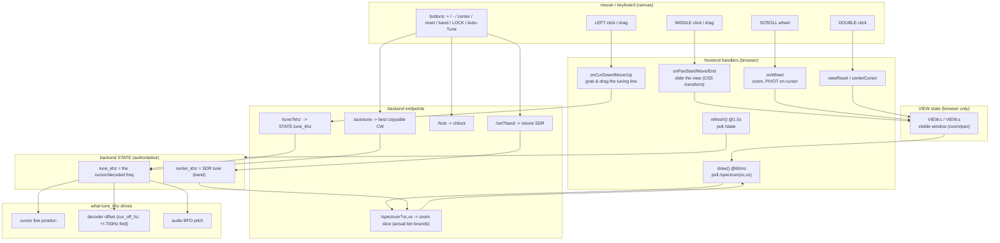
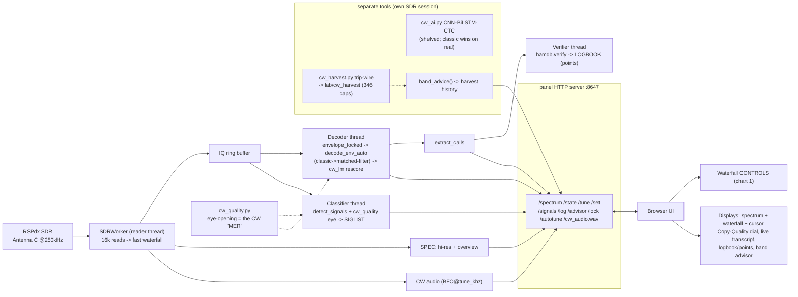

# hamTuna panel — controls & architecture (don't break the flow)

Reference for the panel's waterfall/tuning controls and how they wire into the
greater hamTuna system. Edit the panel's interaction code against this so a UI
change doesn't silently break tuning/decode/audio.

## 1. Waterfall controls — interaction flow

## The control contract (how the user wants it — don't regress)

| input | action |
|-------|--------|
| **left click / drag** | grab & move the tuning line EXACTLY under the pointer (the mouse is the target). Only this + Auto-Tune/Scan/signal-click ever move `tune_khz`. |
| **middle click + drag** | slide the waterfall left/right through the band **live** (real-time). |
| **scroll wheel** | zoom in/out, **pivoting on the tuning cursor** (cursor stays put, band expands/contracts around it). |
| **double-click** | reset to full band. |
| **⊙ button** | recenter view on the cursor (find it). **⤢** full band. **+/−** zoom. |
| **AUTO-TUNE** | best copyable CW on the CURRENT band. |
| **SCAN ALL BANDS** | live hop every CW band, tune to the best (guarded, gentle dwell). |

**Invariants — do not break:**
- The cursor moves ONLY on click/drag/auto — never while zooming or panning.
- **Never retune the SDR rapidly** — the RSPdx firmware wedges on fast successive
  `setFrequency`. Band-hop scans use a >=2s dwell + a SCANNING guard; the reader
  self-heals a stalled SDR (reopens after ~8s of no data).
- Every worker thread body is wrapped so a bug can't kill the thread and freeze the
  server (the decoder-new-callsign crash taught us this).
- **VIEW (browser) is separate from STATE (backend).** Zoom/pan change only VIEW
  (the visible window); they never retune the SDR. Only band change moves `center_khz`.
- **`tune_khz` is the one cursor truth** — it drives the cursor line, the decoder
  offset (`cur_off_hz`, then `find_offset ±700 Hz`), and the audio BFO. Left click/drag
  is the only mouse action that sets it (plus Auto-Tune / signal-list click).
- **`/spectrum?vc&vs` returns the ACTUAL bin-aligned center/span** of the slice, not
  the requested values — otherwise signals drift off the cursor on zoom.
- **Zoom pivots on `tune_khz`** so the tuned signal stays put while zooming.
- **Waterfall clears (`wfDirty`) on any zoom/pan/reset** so it repaints at the new scale.
- **no-cache headers on every response** so the browser never serves a stale page.

## 2. Where controls fit in the greater hamTuna system

**System laws (from memory / hard-won):**
- Reader / decoder / classifier / server on **separate threads**; the reader only
  writes the gap-free ring, decode happens off-thread (a slow decode on the read
  thread drops samples).
- Decoder is **classic `decode_env_auto` + `cw_lm`** (reads real callsigns 13/13);
  the neural `cw_ai` is opt-in and currently loses to classic on real signals.
- `cw_quality` eye-opening is the honest copyability metric (pre-decode), feeding
  both the classifier tags and the Copy-Quality dial.
- Panel and harvester are **single-tenant on the SDR** — run one at a time.
